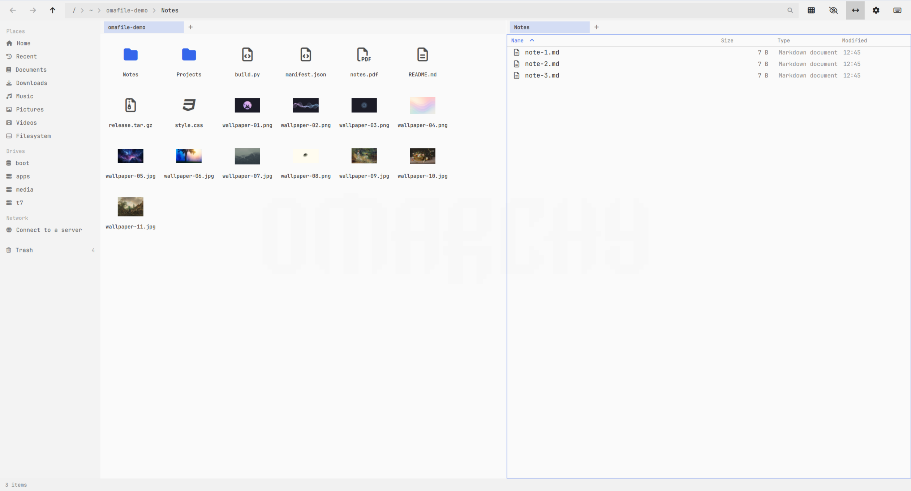

A lightweight, fast file manager plugin for Omarchy running in the shell.



## Features

* Real resizable window with tabs for multiple locations
* Dual pane layout with F5 copy and F6 move between panes
* List and grid view modes
* Live directory watching: external changes appear immediately
* Background copy and move with persistent progress tracking
* Freedesktop trash integration, compatible with GNOME Files
* Recursive file search across directories
* Image previews in both list and grid view
* Recent files, and bookmarks for the folders you use most
* Connect to SMB, SFTP, WebDAV and other servers
* Settings inside the window, no config file editing
* Bar widget with places, drives, transfers, and trash overview
* Keyboard-first workflow with standard shortcuts

## Requirements

* Omarchy 4 (Quattro)
* Python 3 (included with Omarchy)
* util-linux `lsblk` and `findmnt` (included with Arch)
* Optional: `udisksctl` for ejecting removable drives
* Optional: `gvfs` and `gvfs-smb` for connecting to network servers

## Install

```bash
omarchy plugin add https://github.com/chr0nzz/omarchy-omafile.git --enable --yes
```

Plugins run unsandboxed inside the shell process and have full access to your home directory.

## Keybinding and Window Rule

Add to `~/.config/hypr/bindings.lua`:

```lua
o.bind("SUPER + E", "Omafile", "omarchy-shell shell toggle xyzlab.omafile '{}'")
```

Add to `~/.config/hypr/windows.lua`:

```lua
o.window({ class = "^org.quickshell$", title = "^Omafile$" }, { float = true, size = { 1100, 720 }, center = true })
```

Omarchy makes every window slightly transparent, so your wallpaper shows faintly through Omafile the same way it does through every other app. If you would rather Omafile were solid, opt it out of that rule:

```lua
o.window({ class = "^org.quickshell$", title = "^Omafile$" }, { tag = "-default-opacity", opacity = "1 1" })
```

## Usage

Press Super+E to toggle the Omafile window.

Navigate directories with Enter or double-click. Backspace or Alt+Left go up or back; Alt+Right goes forward.

Click any part of the address bar to type a path, or press Ctrl+L. Click a breadcrumb to jump to that folder.

The magnifier at the end of the address bar filters the current folder. Press Ctrl+F instead to search the folder and everything inside it. Escape clears the text, then closes the filter.

Use Ctrl+T to open a new tab and Ctrl+W to close it. Press Tab to switch between the left and right panes.

Copy items between panes with F5 or move them with F6.

Press F7 to create a new folder. Press F2 to rename a file or folder.

Press Delete to move items to trash or Shift+Delete to delete permanently. Cut with Ctrl+X, copy with Ctrl+C, and paste with Ctrl+V. Select all files with Ctrl+A.

Press Ctrl+H to toggle hidden files. Press Ctrl+F to search recursively from the current directory, and Escape to leave the results and return to the folder.

Press Ctrl+D to split the window into two panes and Ctrl+B to hide the sidebar. The toolbar has the same split toggle, next to the view and hidden-file buttons.

Press F1, or the last toolbar button, for the full list of keyboard shortcuts.

Open Settings from the toolbar or with Ctrl+Comma to turn hidden files, folders-first ordering, image previews, trash behaviour and the sidebar drive list on or off.

The Network section of the sidebar holds everything remote. Choose Connect to a server to mount an SMB share, an SFTP host, FTP or WebDAV. Servers you have used before are listed there so one click reconnects, and any server the network advertises appears alongside them. Right click a connected share to disconnect it. Connections use GVFS and need no root; install `gvfs-smb` for Windows shares if it is missing.

Hover a drive in the sidebar and click the eye to hide it. Hidden drives come back from Settings.

Settings also chooses whether Omafile opens as a normal window or as a popup panel centred over the desktop that closes when you click away.

Turn on Default file manager in Settings to have folders opened from other applications land in Omafile. This writes a desktop entry to `~/.local/share/applications/xyzlab.omafile.desktop` and points `inode/directory` at it. Turning it off removes the entry and restores the handler you had before. To do the same from a terminal:

```bash
xdg-mime default xyzlab.omafile.desktop inode/directory
xdg-mime query default inode/directory
```

Right click a folder and choose Bookmark this folder to pin it to the sidebar. Remove a bookmark with the cross beside it.

Recent in Places lists the files you opened most recently, newest first, drawn from the same history the rest of the desktop uses. Opening one takes you straight to the file; there is no folder to go up to, so use a place or a bookmark to leave.

When a copy or move finds a file of the same name, Omafile asks what to do. Choose with the mouse, or press R to replace, K to keep both, S to skip and A to skip every remaining conflict. Escape skips the file.

Press Escape to close the window.

## Settings

Configure these keys through the Omarchy bar widget settings:

| Key | Purpose |
|-----|---------|
| `homePath` | Default directory when opening Omafile |
| `showHidden` | Show hidden files and folders by default |
| `sortBy` | Sort by `name`, `size`, `modified` or `type` |
| `sortDirsFirst` | List directories before files |
| `confirmDelete` | Prompt before deleting items |
| `useTrash` | Send deleted items to trash (vs. permanent deletion) |
| `defaultView` | Start in `list` or `grid` view |
| `terminal` | Terminal command to open in the current directory |
| `editor` | Text editor command to open selected files |
| `showTransferBadge` | Show a progress ring on the bar icon while a transfer runs |
| `showDrives` | Show the Drives section in the sidebar |
| `thumbnails` | Show image previews in grid view |
| `glyph` | Custom icon for the bar widget |

## Command Line

Open a specific directory or reveal a file:

```bash
omarchy-shell omafile open /path/to/directory
omarchy-shell omafile reveal /path/to/file
```

Move a file or folder to trash:

```bash
omarchy-shell omafile trash /path/to/item
```

Open the keyboard shortcut list:

```bash
omarchy-shell omafile shortcuts
```

Toggle the window from a keybinding or script:

```bash
omarchy-shell omafile toggle
```

Check the helper, running transfers, drives and trash:

```bash
omarchy-shell omafile status
```

## Removal

```bash
omarchy plugin remove xyzlab.omafile
```

Removal leaves one file behind, `~/.local/state/omarchy/omafile/state.json`, which remembers open tabs and recent folders. Delete it if you do not want to keep it.

## License

MIT, Copyright (c) 2026 chr0nzz
